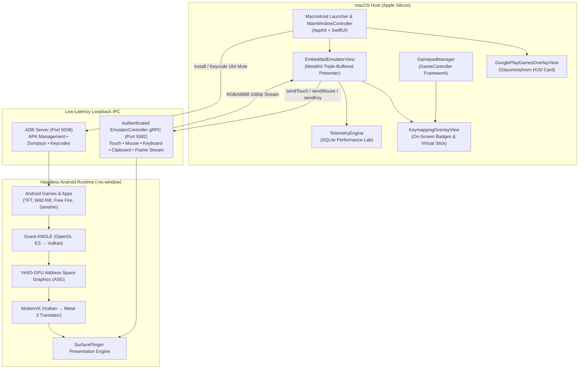

# Macrodroid

<div align="center">


### Native Apple Silicon Android Gaming Platform & Client
**Google Play Games on PC Experience — Built Exclusively for macOS**

[-black?style=for-the-badge&logo=apple)](https://www.apple.com/macos/)
[](https://www.apple.com/mac/)
[](https://swift.org)
[](https://developer.apple.com/metal/)
[-brightgreen?style=for-the-badge)](tests/)
[](LICENSE)

[Features](#-key-features) • [In-Game Overlay](#-in-game-dashboard-overlay-shifttab) • [Keyboard Shortcuts](#-keyboard-shortcuts-cheat-sheet) • [Architecture](#-architecture) • [Getting Started](#-getting-started) • [Community Presets](#-community-presets-catalog) • [Documentation](#-documentation-index)

</div>

---

## 📖 Overview

**Macrodroid** is a state-of-the-art native macOS gaming client that brings the **Google Play Games on PC** experience to Apple Silicon Macs. Engineered in Swift 6 and MetalKit, it runs official Android games and applications through a headless, highly optimized Google Android Emulator instance—bypassing clunky third-party emulators, Qt window wrappers, and virtual machine overhead.

Macrodroid embeds the Android graphics stream directly into a native AppKit window rendered via a triple-buffered Metal 3 pipeline, delivering fluid **60 to 144 Hz** refresh rates, sub-millisecond input responsiveness, on-screen keymapping, PlayStation/Xbox gamepad integration, and continuous telemetry logging.

---

## 🌟 Key Features

### 🎮 Google Play Games on PC Parity
- **In-Game Dashboard Overlay (`Shift+Tab`)**: Glassmorphism HUD inspired by Google Play Games PC. Access controls, framerate targets, keymap opacity, screenshot capture, and audio settings without interrupting gameplay.
- **Real-Time Playtime & Session Tracking**: Monitors active session time and persists cumulative playtime (`3h 25m played`) and last-played timestamps across game sessions.
- **Dynamic Controller Detection**: Automatically identifies connected gamepads (PlayStation DualSense, DualShock 4, Xbox Wireless Controller, Nintendo Switch Pro, MFi) and displays an active status badge on the HUD.
- **In-Game Audio Mute**: Dedicated one-click audio mute/unmute toggle sending hardware keycode 164 (`KEYCODE_VOLUME_MUTE`) to the guest OS with HUD toast notifications.
- **One-Touch Keymap Preset Reset**: Instantly restore key bindings to official community-curated presets with a single click.
- **Mouse Aim Lock Mode (`F10` / `⌥`)**: Native mouse cursor capture with smart auto-pause when the HUD opens and seamless re-lock upon resuming.
- **High-Refresh eSports Pacing**: Switch refresh targets dynamically between **60 Hz**, **90 Hz**, **120 Hz ProMotion**, and **144 Hz Competitive eSports**.

### 📱 Modern Launcher Experience
- **PlayCover / GPG Inspired Library**: Clean dark-mode launcher featuring game covers, playtime badges in emerald green, version tags, and search filtering.
- **Drag & Drop APK Installation**: Simply drag any `.apk` file into the launcher window or drop overlay to install instantly via ADB.
- **`.macrodroid` Bundle Sharing**: Export and import complete game packages (profile settings + custom keymaps) with drag-and-drop ease.
- **Per-Game Inspector Sheet**: Customize aspect ratios (16:9 Landscape vs 9:16 Portrait), resolution (720p to 4K Retina), CPU/RAM allocation, and create one-click macOS Dock shortcuts (`Add to Mac / Dock`).

### ⌨️ Keymapping & Gamepad Engine
- **Visual On-Screen Keymapping Overlay (`⌘K` toggle, `⌥⌘K` editor)**: Drag-and-drop key badges onto screen coordinates to bind keyboard keys and mouse buttons.
- **D-Pad Virtual Joystick**: Smooth WASD movement mapped to touch vectors with deadzone compensation.
- **Extended Gamepad Support**: Full analog thumbstick steering, D-Pad routing, bumper/trigger binding, and L3/R3 button support.
- **Community Hub**: Built-in curated presets for top titles (*Wild Rift, Free Fire, PUBG Mobile, Genshin Impact, Teamfight Tactics, Mobile Legends, COD Mobile*).

### 🤖 Macro Automation Engine
- **Record & Replay Gestures (`⌥⌘R` record, `⌥⌘P` play)**: Record mouse clicks, drags, and key combinations with precise millisecond interval pacing (`delayAfterMS`).
- **Human Variance Jitter**: Anti-detection coordinate perturbation simulating natural fingertip touch variance.

### ⚡ Ultra-Low Latency Graphics Pipeline
- **Metal 3 Native Presenter**: Zero-copy RGBA framebuffer presentation with triple-buffering on Apple Silicon GPUs.
- **ANGLE + MoltenVK Bridge**: Direct OpenGL ES and Vulkan translation mapped to native Metal draw commands via VirtIO-GPU Address Space Graphics (ASG).
- **Smooth Window Resizing & Freeform Mode (`⌘M`)**: Seamlessly switch between fixed aspect-ratio scaling and freeform Android desktop multi-windowing.

### 🇻🇳 Native macOS Input & Vietnamese IME
- **Telex & VNI IME Composition (`⌘I`)**: Native macOS Input Method composition forwarded directly to guest text fields without duplicate keystrokes.
- **Trackpad Gestures**: Smooth 2-finger scrolling and pinch-to-zoom magnification gestures.
- **Bidirectional Clipboard**: Instant copy-paste synchronization between macOS and Android.

---

## 🕹️ In-Game Dashboard Overlay (`Shift+Tab`)

Press `Shift + Tab` at any time while playing to summon the native Game Dashboard:

```
┌────────────────────────────────────────────────────────────────────────────┐
│ [Icon]  Teamfight Tactics                     [ 🎮 DualSense ]  [ 120 FPS ]│
│         Macrodroid Play Engine • Metal 3 GPU                               │
│         ⏱️ Session: 14m · Total: 3h 25m                                    │
│ ────────────────────────────────────────────────────────────────────────── │
│  CONTROLS & AIM                          DISPLAY & SYSTEM                  │
│  ┌──────────────────────────────────┐    ┌───────────────────────────────┐ │
│  │ ⌨️ Remap Controls        (⌥⌘K)   │    │ ⛶ Fullscreen          (F11/⌘F)│ │
│  │ 👁️ Toggle Keys            (⌘K)   │    │ 🔄 Rotate Screen         (⌘R) │ │
│  │ ↺ Reset Keymap to Defaults       │    │ 🗖 Freeform Window       (⌘M) │ │
│  │ 🎯 Lock Mouse Aim      (F10 / ⌥) │    │ 🔊 Mute Game Sound            │ │
│  │                                  │    │                               │ │
│  │ Keymap Opacity: [ ━━━━━●━━━ ]    │    │ Refresh Rate:                 │ │
│  │                                  │    │ [ 60Hz | 90Hz | 120Hz | 144Hz]│ │
│  └──────────────────────────────────┘    └───────────────────────────────┘ │
│ ────────────────────────────────────────────────────────────────────────── │
│ [📷 Screenshot] [📁 Shared Folder] [⚙️ Settings]   [Exit]    [ Resume Game ]│
└────────────────────────────────────────────────────────────────────────────┘
```

---

## ⌨️ Keyboard Shortcuts Cheat Sheet

| Shortcut | Action | Description |
|---|---|---|
| `Shift + Tab` | **Toggle Game Dashboard** | Opens/closes the Google Play Games PC HUD overlay card |
| `Escape` | **Hierarchical Dismiss** | Dismisses Dashboard → Closes Keymap Editor → Unlocks Aim → Android Back |
| `⌘ + K` | **Toggle Keymap Hints** | Shows or hides on-screen key badges overlay |
| `⌥ + ⌘ + K` | **Keymap Editor** | Opens the visual drag-and-drop keymapping editor |
| `F10` or `⌥ (Option)` | **Toggle Mouse Aim Lock** | Locks cursor to center for FPS/Shooting games; unhides cursor on release |
| `F11` or `⌘ + F` | **Toggle Fullscreen** | Enters/exits macOS native fullscreen Space with HUD toast feedback |
| `⌘ + R` | **Rotate Screen** | Toggles orientation between Landscape (16:9) and Portrait (9:16) |
| `⌘ + M` | **Freeform Windowing** | Toggles Android Freeform desktop multi-window mode |
| `⌘ + T` | **Task Switcher** | Displays native popup menu of currently active guest Android tasks |
| `⌘ + S` | **Lossless Screenshot** | Captures active Metal frame to `~/Macrodroid/Screenshots` and clipboard |
| `⌘ + O` | **Shared Folder** | Opens two-way shared transfer folder `~/Macrodroid/Shared` |
| `⌘ + ,` | **Macrodroid Settings** | Opens hardware allocation, graphics backend, and audio preferences |
| `⌘ + I` | **Toggle Vietnamese IME** | Activates native macOS Telex/VNI text composition for Android fields |
| `⌥ + ⌘ + R` | **Record Macro** | Starts or stops recording an automated touch/key macro sequence |
| `⌥ + ⌘ + P` | **Play Macro** | Replays the last recorded macro sequence with human jitter variance |

---

## 🏗 Architecture



---

## 📋 Requirements & System Compatibility

| Component | Minimum Specification | Recommended Specification |
|---|---|---|
| **Mac Model** | Apple Silicon M1 (8-core) | Apple Silicon M2 / M3 / M4 (Pro / Max) |
| **Operating System** | macOS 15.0 (Sequoia) | macOS 15.2+ (Sequoia) |
| **RAM** | 8 GB Unified Memory | 16 GB+ Unified Memory |
| **Android Emulator** | Google Android Emulator 37.1.11+ (ARM64) | Latest Android SDK Command-Line Tools |
| **Guest System Image** | Android 16 (API 36) Google APIs ARM64 | Android 16 (API 36) Google Play ARM64 |
| **Host Toolchain** | Xcode 16.0+ / Swift 6.0 | Xcode 16.2+ |

---

## 🚀 Getting Started

### 1. Clone the Repository
```sh
git clone https://github.com/LamPPKK/Macrodroid.git
cd Macrodroid
```

### 2. Build the Application Bundle
Execute the automated release compilation script:
```sh
/bin/zsh scripts/build-macrodroid-app.command
```
The compiled, self-contained application will be produced at:
```text
dist/Macrodroid.app
```

### 3. Run the Automated Test Suite
Macrodroid includes an authoritative 99-test suite verifying FrameContracts, ViewportMappers, AVD transactions, Gamepad models, Playtime persistence, Keymap preset restorations, and Vietnamese IME:
```sh
DEVELOPER_DIR=/Applications/Xcode.app/Contents/Developer \
xcodebuild test \
  -project Macrodroid.xcodeproj \
  -scheme Macrodroid \
  -configuration Debug \
  -destination 'platform=macOS' \
  ONLY_ACTIVE_ARCH=YES \
  CODE_SIGNING_ALLOWED=NO
```
*Current test pass rate: **99 / 99 passed (100%)**.*

### 4. Comprehensive 6-Phase Repository Verification
To validate toolchains, SwiftLint compliance, shell scripts, SQL telemetry schema, and unit test suites:
```sh
/bin/zsh scripts/test-all.command
```

---

## 🎮 Community Presets Catalog

Macrodroid ships with pre-configured, community-curated keymapping presets designed for competitive PC gaming:

| Game Title | Package Identifier | Default Orientation | Controls Layout | Target FPS |
|---|---|---|---|---|
| **League of Legends: Wild Rift** | `com.riotgames.league.wildrift` | Landscape (16:9) | MOBA layout: Q/W/E/R skills, D/F spells, Space attack, WASD camera | 120 FPS |
| **Free Fire / Free Fire MAX** | `com.dts.freefireth` | Landscape (16:9) | FPS Shooting: WASD move, Left Click fire, Right Click aim, F10 aim lock, Space jump, C crouch | 90 FPS |
| **PUBG Mobile** | `com.tencent.ig` / `com.vng.pubgmobile` | Landscape (16:9) | Battle Royale: WASD movement, F10 aim lock, R reload, C crouch, Z prone, Shift sprint | 90 FPS |
| **Genshin Impact** | `com.miHoYo.GenshinImpact` | Landscape (16:9) | Action RPG: WASD move, Space jump, Left Click attack, E skill, Q burst, 1-4 character swap | 60 FPS |
| **Teamfight Tactics (TFT)** | `com.riotgames.league.teamfighttactics` | Landscape (16:9) | Strategy Auto-Battler: Direct precision touch, 1-5 shop hotkeys, D reroll, F XP buy | 120 FPS |
| **Mobile Legends: Bang Bang** | `com.mobile.legends` | Landscape (16:9) | MOBA: WASD virtual stick, J/K/L skills, Space basic attack, B recall | 120 FPS |
| **TikTok / Reels (Social)** | `com.ss.android.ugc.trill` | Portrait (9:16) | Vertical Social: Up/Down arrow swipe, Space like, C comment, trackpad scroll | 60 FPS |

---

## 📁 Repository Directory Structure

```text
Macrodroid/
├── Macrodroid/                     # Core Swift Application Source Code
│   ├── App/                        # Lifecycle, AppCoordinator, MainWindowController, Settings
│   │   ├── AppCoordinator.swift            # Window routing, engine lifecycle, session playtime persistence
│   │   ├── MainWindowController.swift      # AppKit window container, titlebar accessories, toasts
│   │   └── RuntimeSettingsWindowController.swift # Graphics, FPS, CPU/RAM, mic settings sheet
│   ├── Launcher/                   # Modern Game Library & Discovery
│   │   ├── MacrodroidLauncherView.swift    # SwiftUI App Library (Grid & List, playtime badges)
│   │   ├── LauncherWindowController.swift  # Host window for launcher UI
│   │   └── AppIconExtractor.swift          # ADB high-res icon and version extractor
│   ├── Presentation/               # Metal Presentation & In-Game Overlays
│   │   ├── EmbeddedEmulatorView.swift      # Metal MTKView, input capture, session timer, gesture router
│   │   ├── GooglePlayGamesOverlayView.swift # In-Game Dashboard HUD (Shift+Tab glassmorphism card)
│   │   ├── KeymappingOverlayView.swift     # On-screen key badge renderer & visual drag editor
│   │   ├── FrameContract.swift             # 1080p/4K RGBA buffer validation
│   │   └── ViewportMapper.swift            # Aspect-ratio preserving coordinate translator
│   └── Runtime/                    # Emulation, Telemetry, and Automation
│       ├── MacrodroidRuntime.swift         # gRPC client service, process manager, ADB channels
│       ├── AppProfileModel.swift           # AppProfile, resolution, FPS, totalPlayTimeSeconds
│       ├── KeymappingModel.swift           # KeymapProfile, button bindings, KeymapProfileStore
│       ├── CommunityHubModel.swift         # Curated official game presets & regional matching
│       ├── GamepadManager.swift            # GameController framework bridge & virtual stick math
│       ├── MacroAutomationModel.swift      # Action recorder, pacing timeline, jitter variance
│       └── CombatBenchmarkAnalysis.swift   # SurfaceFlinger frame pacing & stutter detection
├── Tests/MacrodroidTests/          # 99 Native Unit Tests
│   ├── MacrodroidGate1Tests.swift          # Comprehensive unit tests (Playtime, Keymaps, Inputs)
│   ├── GameFrameTelemetryTests.swift      # Framebuffer telemetry tests
│   └── CombatBenchmarkAnalysisTests.swift # Stutter and frame pacing analysis tests
├── Vendor/                         # Google Android Emulator gRPC Protocol Definitions
├── scripts/                        # Build, test, and verification automation scripts
├── docs/                           # In-depth architectural documentation
├── CHANGELOG.md                    # Release history and version updates
├── project.md                      # Authoritative project record and evolution log
└── dev.md                          # Developer handbook and code ownership guide
```

---

## 📚 Documentation Index

- 📘 [Project History & Record (`project.md`)](project.md): Architectural history, evolution from TFT prototype to Macrodroid 5.4, and design invariants.
- 🛠 [Developer Handbook (`dev.md`)](dev.md): Code ownership guide, Swift 6 concurrency rules, debugging workflows, and testing instructions.
- 📐 [Architecture Deep Dive (`docs/architecture.md`)](docs/architecture.md): Detailed explanation of the Metal 3 presenter, gRPC loopback, and ASG transport.
- 🔬 [Performance Lab & Telemetry (`docs/telemetry.md`)](docs/telemetry.md): SQLite telemetry schema, monotonic timers, and SurfaceFlinger analysis.
- 📝 [Changelog (`CHANGELOG.md`)](CHANGELOG.md): Comprehensive version history from v1.0 through v5.4.

---

## 📄 License & Legal Notice

- **License**: Distributed under the [MIT License](LICENSE).
- **Trademarks**: 
  - Android and Google Play are trademarks of Google LLC.
  - Teamfight Tactics and League of Legends are trademarks or registered trademarks of Riot Games, Inc.
  - PlayStation and DualSense are registered trademarks of Sony Interactive Entertainment Inc.
  - Xbox is a registered trademark of Microsoft Corporation.
  - Mac, macOS, Apple Silicon, and Metal are trademarks of Apple Inc.
- **Disclaimer**: Macrodroid is an independent open-source software project. It is not affiliated with, endorsed by, or sponsored by Google, Riot Games, Sony, Microsoft, or Apple. All game assets, package names, and trademarks belong to their respective owners.
