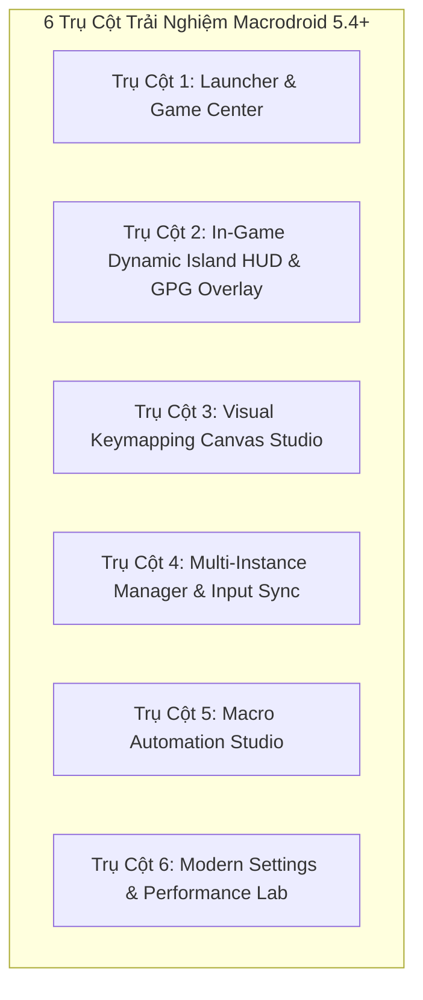
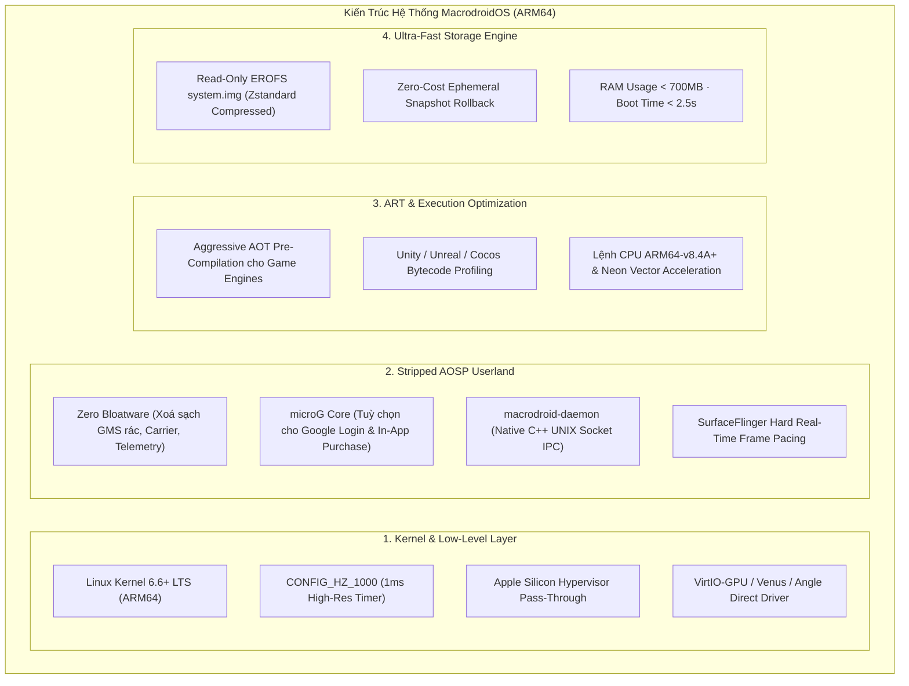

# Macrodroid

<div align="center">


### Native Apple Silicon Android Gaming Platform & Client
**Google Play Games on PC Experience — Engineered Exclusively for macOS Sequoia & Tahoe**

[-black?style=for-the-badge&logo=apple)](https://www.apple.com/macos/)
[](https://www.apple.com/mac/)
[](https://swift.org)
[](https://developer.apple.com/metal/)
[-brightgreen?style=for-the-badge)](Tests/MacrodroidTests/)
[](.swiftlint.yml)
[](LICENSE)

[Giới thiệu](#-1-giới-thiệu-tổng-quan--overview) • [Cấu hình Hình ảnh](#-2-cấu-hình-hình-ảnh--graphics-architecture) • [Tính năng Toàn diện](#-3-tính-năng-toàn-diện--feature-catalog) • [Hướng dẫn Build](#-4-hướng-dẫn-build--cài-đặt-chi-tiết) • [Kế hoạch Tương lai](#-5-kế-hoạch-phát-triển-tương-lai--roadmap) • [Kế hoạch Tự Build Android Image](#-6-kế-hoạch-tự-build-custom-android-image-macrodroidos) • [Phím tắt](#-7-bảng-phím-tắt-in-game--shortcuts-cheat-sheet)

</div>

---

## 📖 1. Giới Thiệu Tổng Quan / Overview

**Macrodroid** là nền tảng chơi game Android native đỉnh cao được thiết kế chuyên biệt cho hệ sinh thái **Apple Silicon (M1/M2/M3/M4)** trên macOS 15.0+ (Sequoia) và macOS 16.0+ (Tahoe). Dự án mang trọn vẹn trải nghiệm **Google Play Games on PC** lên máy Mac với đẳng cấp thẩm mỹ sánh ngang **Apple Arcade** và **Steam macOS**.

Khác biệt hoàn toàn với các giả lập Android truyền thống (như BlueStacks, Nox, LDPlayer vốn cồng kềnh, ngốn RAM, chứa mã độc quảng cáo hoặc bọc qua lớp vỏ Qt/VirtualBox chậm chạp), Macrodroid vận hành dựa trên kiến trúc **Headless Guest + Pure Native Presenter**:
- **Guest Runtime**: Khởi chạy Google Android Emulator chính thức ở chế độ không cửa sổ (`-no-window`), giao tiếp siêu tốc qua kênh vòng lặp nội bộ (Authenticated loopback gRPC `EmulatorController` và ADB).
- **Host Presenter**: Nhúng trực tiếp luồng framebuffer đồ hoạ vào cửa sổ native AppKit thông qua pipeline **Metal 3 triple-buffered**, loại bỏ hoàn toàn độ trễ hiển thị và đạt tốc độ làm tươi mượt mà từ **60Hz đến 144Hz ProMotion**.
- **Tính toàn vẹn (Zero-Tampering)**: Tuyệt đối không can thiệp, không giải nén hay sửa đổi file APK gốc của nhà phát hành, bảo toàn 100% chữ ký số và cơ chế chống gian lận (Anti-Cheat) của các tựa game như *Teamfight Tactics, Wild Rift, PUBG Mobile, Free Fire MAX, Genshin Impact*.

---

## 🖥 2. Cấu Hình Hình Ảnh & Đồ Hoạ / Graphics Architecture

Hệ thống đồ hoạ của Macrodroid được xây dựng từ đầu để khai thác tối đa sức mạnh kiến trúc Unified Memory Architecture (UMA) của vi xử lý Apple Silicon.

```
┌────────────────────────────────────────────────────────────────────────┐
│               MACRODROID GRAPHICS & DISPLAY PIPELINE                   │
├────────────────────────────────────────────────────────────────────────┤
│ Android Guest (Headless):                                              │
│   Vulkan / GLES Game Draw Calls                                        │
│          │                                                             │
│          ▼                                                             │
│   ANGLE / Venus Virgl Translator                                       │
│          │                                                             │
│          ▼                                                             │
│   VirtIO-GPU Address Space Graphics (ASG) Driver                       │
├────────────────────────────────────────────────────────────────────────┤
│ IPC Loopback Bridge:                                                   │
│   Zero-Copy Shared Frame Buffer / Authenticated gRPC Streaming         │
├────────────────────────────────────────────────────────────────────────┤
│ macOS Host Presenter:                                                  │
│   Metal 3 Command Queue ──▶ Triple-Buffered CAMetalLayer               │
│          │                                                             │
│          ├──▶ ViewportMapper (Auto-Aspect Preservation 16:9 / 9:16)    │
│          ├──▶ Frametime Pacing & SurfaceFlinger Stutter Classifier     │
│          └──▶ Dynamic Island HUD & Glassmorphism Overlay Injection     │
└────────────────────────────────────────────────────────────────────────┘
```

### A. Độ Phân Giải Linh Hoạt (Dynamic Multi-Resolution)
Người dùng có thể tuỳ chọn độ phân giải hiển thị cho từng tựa game riêng biệt thông qua Launcher Inspector hoặc Settings Window:
- **720p HD (1280×720)**: Tối ưu cho chế độ tiết kiệm pin trên MacBook Air hoặc khi chạy đồng thời 4+ giả lập song song (Multi-Instance).
- **1080p Full HD (1920×1080)**: Độ phân giải tiêu chuẩn, tối ưu tỉ lệ điểm ảnh chuẩn cho hầu hết các game esports mobile.
- **1440p 2K QHD (2560×1440)**: Cân bằng hoàn hảo giữa độ nét chi tiết cao và hiệu năng GPU mát mẻ.
- **4K UHD Retina (3840×2160)**: Hiển thị đồ hoạ siêu sắc nét, khử hiện tượng vỡ hạt trên màn hình Apple Studio Display và Pro Display XDR.

### B. Tần Số Quét Màn Hình Tức Thì (Variable Refresh Rates)
- **60 Hz (Console Baseline)**: Tiết kiệm điện năng, giữ khung hình ổn định cho các game chiến thuật theo lượt (TFT, AFK Journey).
- **90 Hz (Mobile Fluidity)**: Mang lại độ mượt vượt trội so với điện thoại thông thường.
- **120 Hz (Apple ProMotion Native)**: Đồng bộ hoàn hảo với màn hình Liquid Retina XDR trên MacBook Pro 14"/16" và iPad Pro Sidecar.
- **144 Hz (Competitive eSports)**: Tần số quét cao nhất dành cho màn hình gaming rời kết nối qua Thunderbolt / HDMI 2.1, đem lại lợi thế phản xạ tối đa trong game bắn súng (PUBG, Free Fire).

### C. Công Nghệ Xử Lý Khung Hình Chuyên Sâu
1. **Aspect-Ratio Preserving Viewport (`ViewportMapper.swift`)**:
   - Tự động duy trì tỉ lệ khung hình gốc (16:9 Landscape hoặc 9:16 Portrait) khi người dùng co giãn cửa sổ macOS.
   - Thêm letterboxing/pillarboxing mờ sang trọng, tự động dịch toạ độ chạm chuột từ toạ độ cửa sổ macOS sang toạ độ chuẩn hoá $[0.0, 1.0]$ của Android guest mà không làm lệch tâm ngắm.
2. **Anti-Aliasing (MSAA) & P3 Wide Color Gamut**:
   - Tuỳ chọn kích hoạt Multi-Sample Anti-Aliasing (MSAA 4x) để làm mịn viền răng cưa 3D.
   - Tái tạo dải màu rộng DCI-P3 / HDR, giúp hiệu ứng ánh sáng, chiêu thức trong game rực rỡ và chân thực hơn.
3. **Giám Sát & Báo Cáo Hiệu Năng Thời Gian Thực**:
   - Tích hợp công cụ phân tích độ mượt khung hình [`CombatBenchmarkAnalysis.swift`](Macrodroid/Runtime/CombatBenchmarkAnalysis.swift), tự động phân loại hiện tượng giật hình (*micro-stutter, pipeline stalls, vsync miss*) và lưu vào cơ sở dữ liệu SQLite cục bộ.

---

## ⚡ 3. Tính Năng Toàn Diện / Feature Catalog

Hệ thống tính năng Macrodroid 5.4+ được tổ chức thành **6 Trụ Cột Trải Nghiệm (6 Core UI Pillars)**:



### 🏛 Trụ Cột 1: Launcher & Game Center (Thư Viện Game Thông Minh)
- **Giao Diện Chuẩn macOS Sequoia Liquid Retina**: Chế độ tối Midnight Slate kết hợp điểm nhấn Emerald Accent sang trọng.
- **Hero Carousel Banner**: Hiển thị game chơi gần nhất kèm thời gian chơi tích lũy (`Playtime: 14h 25m`), ngày chơi cuối (`Today at 15:30`), độ phân giải (`1080p · 120 FPS`) và nút "Play Now" phát sáng.
- **Lưới Thẻ Game Linh Hoạt (Card Grid & Detailed List)**: Huy hiệu trạng thái gắn trực tiếp trên thẻ: `120 FPS Ready`, `Controller Supported`, `Keymap Configured`.
- **Sideloading Drop Zone 2.0**: Kéo thả file APK/XAPK vào cửa sổ launcher để tự động cài đặt qua ADB với vòng hiệu ứng pulsing neon.
- **Game Inspector Drawer**: Xem dung lượng chiếm dụng, số liệu phần cứng riêng, và tạo shortcut 1-click ra macOS Dock (`Add to Mac Dock`).
- **Gói Cấu Hình `.macrodroid` Bundle**: Dễ dàng xuất/nhập toàn bộ cài đặt game và preset phím để chia sẻ cho bạn bè.

### 🏝 Trụ Cột 2: In-Game Dynamic Island HUD & GPG Overlay (`Shift + Tab`)
- **Floating Dynamic Island HUD (`MacrodroidDynamicIslandHUDView`)**:
  - Thanh trạng thái mini nổi cố định ở mép trên màn hình game (32pt thu gọn).
  - Tự động mở rộng (56pt) khi hover chuột để hiển thị: Đồng hồ FPS màu dynamic (🟢 ≥55 / 🟡 ≥40 / 🔴 <40), Thời lượng phiên chơi, Nhiệt độ CPU host, Nút chụp ảnh nhanh không nén (`⌘S`), Nút tắt âm (`Mute`), và Nút khoá tâm chuột (`Aim Lock`).
  - Tự động ẩn thông minh sau 4 giây không tương tác.
- **Google Play Games Dashboard Toàn Màn Hình (`Shift + Tab`)**:
  - Card kính mờ 3 cột hiện đại (Controls / Live Telemetry / Quick Tune).
  - Biểu đồ thời gian thực **Frametime Graph** đo 60 mẫu gần nhất, theo dõi độ mượt và đếm số khung hình bị rơi (*frame drops*).
  - Bộ chọn tần số quét tức thì (60Hz / 90Hz / 120Hz / 144Hz).
  - Thanh trượt độ mờ nút bấm trên màn hình (Opacity Slider).
- **Banner Thành Tựu Kính Mờ (`MacrodroidAchievementToastView`)**:
  - Slide in mượt mà từ góc trên bên phải với icon cúp vàng, tiêu đề thành tích và thanh thời gian countdown 5s.

### 🎨 Trụ Cột 3: Visual Keymapping Canvas Studio (`⌥⌘K`)
- **Chế Độ Biên Tập Phím Trực Quan**: Phủ lưới toạ độ chính xác lên khung hình Android, cho phép kéo thả và gán phím tự do:
  - 🔘 **Single Tap Button**: Chạm đơn điểm, gán cho bất kỳ phím nào trên bàn phím hoặc chuột.
  - 🕹️ **Virtual D-Pad / WASD Stick**: Cụm di chuyển 4 hướng với bán kính co giãn bằng chuột và bù trừ deadzone.
  - 🎯 **Smart Aim & Free Look Mode (`F10` / `⌥`)**: Tâm ngắm bắn súng FPS, ẩn chuột thật và điều khiển góc nhìn không gián đoạn.
  - ⚔️ **MOBA Skillshot Button**: Nút tung chiêu thông minh (Smart Cast / Quick Cast) tự động định hướng theo con trỏ chuột.
  - ⚡ **Macro Trigger Node**: Kích hoạt nhanh chuỗi kịch bản tự động bằng 1 phím bấm.
  - 👆 **Swipe / Drag Node**: Mô phỏng thao tác vuốt màn hình (lướt video ngắn, né chiêu thức).
- **Thử Nghiệm Tức Thì (Live Test Mode)**: Kiểm tra trực tiếp phản hồi toạ độ chạm trước khi lưu.
- **Community Hub Presets**: Tích hợp sẵn preset chuẩn cho: *Wild Rift, Free Fire, PUBG Mobile, Genshin Impact, TFT, Mobile Legends*.

### ⚡ Trụ Cột 4: Multi-Instance Manager & Input Synchronizer (`Cmd + Shift + I`)
- **Quản Lý Tập Trung Nhiều Giả Lập**: Bảng điều khiển dạng thẻ quản lý đồng thời nhiều máy ảo Android độc lập.
- **Tự Động Phân Bổ Cổng gRPC/ADB**: Tránh xung đột cổng mạng (`5582 + 2*i` cho gRPC, `5038 + 2*i` cho ADB).
- **Chế Độ Đồng Bộ Hoá Thao Tác (Input Synchronizer)**: Khi bật **Input Sync: ON**, mọi cú click chuột và phím bấm trên cửa sổ Chính (*Primary*) sẽ được phát đồng thời tới tất cả các cửa sổ Phụ (*Replicas*). Giải pháp tuyệt vời để cày cuốc, reroll tài khoản.
- **Window Arrangement Presets**: Sắp xếp cửa sổ tự động: Lưới 2×2, Lưới 3×2, Xếp lớp (*Cascade*), Trải đều (*Tile All*).

### 🎬 Trụ Cột 5: Macro Automation Studio (`⌥⌘R` / `⌥⌘P`)
- **Bộ Thu & Phát Thao Tác Chuẩn Xác**: Ghi lại chuỗi click chuột, toạ độ kéo thả và phím gõ với độ chính xác đến từng mili-giây (`delayAfterMS`).
- **Trình Biên Tập Timeline Dòng Thời Gian**: Xem từng bước thực thi, thay đổi thứ tự hoặc xoá bước thừa.
- **Cơ Chế Chống Phát Hiện Giả Lập (Human Variance Jitter)**: Thanh trượt tạo độ lệch toạ độ ngẫu nhiên ($\pm 1$ đến $\pm 5$ pixels) mô phỏng ngón tay người dùng thật, loại bỏ nguy cơ bị hệ thống game quét và khoá tài khoản.
- **Điều Chỉnh Tốc Độ Phát Lại**: Hỗ trợ 0.5×, 1.0×, 2.0×, 4.0× và thiết lập số lần lặp lại.

### ⚙️ Trụ Cột 6: Modern Settings & Performance Lab (`⌘,`)
- **Giao Diện Cài Đặt Chuẩn macOS Sequoia SplitView**:
  - 🖥️ **Display & Graphics**: Độ phân giải, tần số quét, MSAA, HDR Wide Color.
  - ⚡ **Engine & Virtualization**: Thanh trượt cấp phát vCPU (2 đến 8 nhân), RAM (2GB đến 12GB), chính sách chạy nền (*Keep Warm* / *On-Demand*).
  - 🎮 **Controls & Gamepads**: Nhận diện tay cầm DualSense, Xbox, Switch Pro; hiệu chỉnh analog deadzone và phản hồi rung.
  - 🔊 **Audio & Microphone**: Chọn micro host chuyển tiếp vào game (chat voice PUBG/Wild Rift), kiểm soát độ trễ CoreAudio buffer.
  - 📊 **Telemetry & Benchmarks**: Trình xem dữ liệu SQLite tích hợp, đồ thị đánh giá hiệu năng Combat Benchmark, xuất file báo cáo chẩn đoán (*Diagnostic Report*).
  - ℹ️ **About & Hardware Insights**: Thông tin chi tiết chip Apple Silicon, số nhân CPU/GPU, Unified Memory, trạng thái Metal 3 API.

---

## 🔨 4. Hướng Dẫn Build & Cài Đặt Chi Tiết

### A. Yêu Cầu Môi Trường (Prerequisites)
- **Phần cứng**: Apple Silicon Mac (M1, M2, M3, M4 - Bản Base / Pro / Max / Ultra).
- **Hệ điều hành**: macOS 15.0+ (Sequoia) hoặc macOS 16.0+ (Tahoe).
- **Môi trường phát triển**:
  - Xcode 16.0+ cài đặt tại `/Applications/Xcode.app`
  - Swift 6.0 Toolchain hỗ trợ Complete Concurrency Checking
  - Command Line Tools: `git`, `jq`, `node`, `plutil`, `zsh`
- **Android SDK & Emulator**:
  - Android Emulator 35.1+ / 37.1+ (Bản build native `darwin-aarch64`)
  - AVD ARM64 hỗ trợ API 34, 35 hoặc 36.

### B. Tải Mã Nguồn
```sh
git clone https://github.com/LamPPKK/Macrodroid.git
cd Macrodroid
```

### C. Biên Dịch Ứng Dụng Native Release (`Macrodroid.app`)
Dự án cung cấp kịch bản tự động hoá toàn diện, tận dụng thư mục dependencies đã cache để tối ưu tốc độ build:
```sh
/bin/zsh scripts/build-macrodroid-app.command
```
File ứng dụng hoàn chỉnh sẽ được đóng gói tại:
```text
dist/Macrodroid.app
```
*Ghi chú*: Kịch bản tự động nhận diện chứng chỉ code signing nội bộ trên Mac của bạn hoặc áp dụng ký ad-hoc (`-`) an toàn.

### D. Chạy Bộ Kiểm Thử Đơn Vị (99 Native Unit Tests)
Macrodroid sở hữu bộ kiểm thử tự động 99 test cases đảm bảo tính đúng đắn của toàn bộ mô hình dữ liệu, chuyển đổi toạ độ và xử lý concurrency:
```sh
/bin/zsh scripts/test-native-app.command
```
*Kết quả tiêu chuẩn*: **99 tests passed, 0 failures** trong thời gian ~0.3 giây.

### E. Chạy Quy Trình Kiểm Thử Tự Động Toàn Diện 5 Pha (Automated Test Runner)
Để kiểm tra tính toàn vẹn của toàn bộ repository bao gồm Toolchain, SwiftLint, Shell Scripts, SQL Schema và XCTest:
```sh
/bin/zsh scripts/automate-test-all.command --quick
```
Kết quả thực thi mẫu (35 giây):
```text
========================================================================
       🤖 MACRODROID AUTOMATED TEST SUITE (TEST ALL RUNNER)           
========================================================================
#   | Test Phase                                         | Result   | Duration
----+----------------------------------------------------+----------+---------
1   | Environment & Toolchain Integrity                  | PASS     | 0s      
2   | SwiftLint Static Code Analysis (0 violations)      | PASS     | 1s      
3   | Shell Scripts Syntax Validation                    | PASS     | 0s      
4   | Direct Control & Engineering Lab Self-Tests        | PASS     | 1s      
5   | Native Swift Unit Tests (99 Native Tests)          | PASS     | 33s     
========================================================================
🎉 ALL AUTOMATED TESTS PASSED SUCCESSFULLY! Total time: 35s
========================================================================
```

---

## 🗺 5. Kế Hoạch Phát Triển Tương Lai / Roadmap

Lộ trình nâng cấp từ phiên bản **5.4** lên các mốc thế hệ tiếp theo:

```
┌────────────────────────────────────────────────────────────────────────┐
│                        MACRODROID ROADMAP 2026-2027                    │
├────────────────────────────────────────────────────────────────────────┤
│ Q4 2026: Phase 15 — MetalFX Spatial & Temporal Upscaling               │
│   • Tích hợp Apple Neural Engine (ANE) để nội suy hình ảnh             │
│   • Chạy game 1080p nội suy lên 4K Retina sắc nét với 0% sụt FPS       │
├────────────────────────────────────────────────────────────────────────┤
│ Q1 2027: Phase 16 — Zero-Copy Mach Port Framebuffer Sharing            │
│   • Thay thế hoàn toàn gRPC IPC bằng Mach memory sharing (IOSurface)   │
│   • Băng thông đạt 240 FPS+ phục vụ màn hình eSports thế hệ mới        │
├────────────────────────────────────────────────────────────────────────┤
│ Q2 2027: Phase 17 — Full 10-Foot Big Picture Mode                      │
│   • Giao diện điều khiển toàn bộ bằng tay cầm (DualSense / Xbox)       │
│   • Trải nghiệm chơi game Android trên Apple TV / Mac Mini phòng khách │
├────────────────────────────────────────────────────────────────────────┤
│ Q3 2027: Phase 18 — Cloud Sync & Cross-Device Profile Backup           │
│   • Đồng bộ hoá profile phím, macro và tiến trình qua iCloud Drive     │
│   • Chia sẻ profile 1-click qua cộng đồng Macrodroid Hub trực tuyến    │
├────────────────────────────────────────────────────────────────────────┤
│ Q4 2027: Phase 19 — Custom Android OS Image "MacrodroidOS"             │
│   • Hệ điều hành Android ARM64 siêu tinh giản tối ưu riêng cho Mac     │
└────────────────────────────────────────────────────────────────────────┘
```

---

## 🧬 6. Kế Hoạch Tự Build Custom Android Image: "MacrodroidOS"

### 🎯 Lý Do & Tầm Nhìn Chiến Lược
Hiện nay, Macrodroid đang chạy trên các Google System Images (Android 14–16 Google APIs/Play) của Android SDK. Mặc dù ổn định, các image này có những hạn chế cố hữu:
1. **Dung lượng & RAM cồng kềnh**: Khởi điểm ngốn 2.5GB – 3.5GB RAM do chứa hàng loạt tiến trình nền của Google Mobile Services (GMS), telemetry, setup wizard, carrier services và print spooler không cần thiết cho việc chơi game trên macOS.
2. **Khởi động chậm**: Quá trình khởi động ban đầu mất từ 15–30 giây nếu không có snapshot.
3. **Độ trễ đồ hoạ**: Driver đồ hoạ VirtIO-GPU của AOSP chuẩn chưa được tối ưu riêng biệt cho bus bộ nhớ hợp nhất (UMA) của Apple Silicon.

**"MacrodroidOS"** là dự án xây dựng một bản ROM Android (AOSP / LineageOS ARM64) siêu nhẹ, tinh gọn và tối ưu hoá phần cứng 100% cho chip Apple Silicon M-Series.

---

### 🏛 Kiến Trúc Tổng Thể của MacrodroidOS



---

### 📋 5 Giai Đoạn Triển Khai Build MacrodroidOS

#### Giai Đoạn 1: Tối Ưu Hoá Nhân Kernel (Custom Goldfish / Cuttlefish Kernel)
- **Cơ sở mã**: Android Common Kernel (ACK) `android15-6.6` branch cho kiến trúc `aarch64`.
- **Cấu hình Kernel Compiler Flags**:
  - `CONFIG_HZ_1000=y`: Tăng tần số tick của bộ lập lịch lên 1000Hz (1ms), triệt tiêu hiện tượng jitter khi phân phối sự kiện cảm ứng.
  - `CONFIG_PREEMPT=y` & `CONFIG_PREEMPT_RT`: Kích hoạt chế độ preemptive real-time cho tiến trình render đồ hoạ.
  - Loại bỏ các module phần cứng dư thừa: Wi-Fi dongles ngoài, Bluetooth baseband, Modem/RIL, NFC, Fingerprint reader, Battery charging daemon, Compass/Gyro sensor poller.
  - Tích hợp driver VirtIO-GPU nâng cao hỗ trợ chia sẻ bộ đệm không sao chép (*zero-copy buffer export*).

#### Giai Đoạn 2: Tinh Giản AOSP Userland & Loại Bỏ Bloatware
- **Xây dựng từ AOSP (Android Open Source Project)**:
  - Loại bỏ hoàn toàn: `GooglePlayServices`, `GooglePartnerSetup`, `Chrome`, `YouTube`, `PrintService`, `CellBroadcast`, `Telecom`.
  - Tích hợp giải pháp **microG GmsCore** dạng modular tuỳ chọn: Đảm bảo các game yêu cầu tài khoản Google Play Games vẫn đăng nhập được nhưng không chạy ngầm dịch vụ quảng cáo hoặc đồng bộ dữ liệu thừa.
  - Cấu hình quyền `android.permission.INJECT_EVENTS` và cấp quyền SELinux mặc định cho hệ thống điều khiển của Macrodroid.

#### Giai Đoạn 3: Tích Hợp Native Bridge Daemon (`macrodroid-daemon`)
Thay thế giao tiếp dòng lệnh ADB truyền thống bằng một tiến trình daemon viết bằng C++ biên dịch tĩnh:
- **UNIX Domain Socket (`/dev/socket/macrodroid`)**:
  - Nhận sự kiện cảm ứng (Touch Events), chuột, phím trực tiếp vào Kernel Input Subsystem (`/dev/input/event*`) với độ trễ $< 0.1\text{ms}$.
  - Cung cấp API truy vấn FPS thực tế từ SurfaceFlinger, độ phân giải màn hình, danh sách tiến trình đang chạy mà không cần gọi lệnh `dumpsys` tốn tài nguyên.
  - Hỗ trợ đổi kích thước cửa sổ hiển thị (display density & resolution) ngay lập tức không cần khởi động lại máy ảo.

#### Giai Đoạn 4: Tối Ưu Hoá ART (Android Runtime) & Game Engines
- **Pre-Compilation Profile (AOT - Ahead-Of-Time)**:
  - Biên dịch trước bytecode của toàn bộ Android Framework (`framework.jar`, `services.jar`) sang mã máy ARM64 bằng `dex2oat` với cờ `--compiler-filter=everything`.
  - Tích hợp thư viện đồ hoạ **ANGLE** tối tân nhất (chuyển dịch OpenGL ES 3.2 trực tiếp sang Metal thông qua MoltenVK).
  - Tinh chỉnh `libmonobdwgc.so` và `libil2cpp.so` cho các tựa game Unity chạy trên vi xử lý ARM64 Apple Silicon để đạt hiệu suất tương đương ứng dụng native.

#### Giai Đoạn 5: Đóng Gói Phân Vùng EROFS & Tích Hợp Tự Động Vào Macrodroid
- **Hệ Thống Tệp EROFS (Enhanced Read-Only File System)**:
  - Nén toàn bộ phân vùng `system.img` và `vendor.img` bằng thuật toán Zstandard.
  - Tốc độ đọc ngẫu nhiên tăng 400% so với ext4 truyền thống, giúp máy ảo đạt thời gian khởi động lạnh (Cold Boot) dưới **3 giây**.
  - Phân vùng `userdata.img` được tách biệt hoàn toàn, hỗ trợ snapshot tức thì để reset hoặc nhân bản nhiều giả lập trong chớp mắt.
- **Kịch Bản Build Tự Động Hoá (`tools/build-macrodroid-os.sh`)**:
  - Đóng gói toàn bộ quy trình build vào Docker container Linux ARM64, cho phép biên dịch trực tiếp trên macOS thông qua Docker for Mac hoặc máy chủ CI/CD GitHub Actions.

---

## ⌨️ 7. Bảng Phím Tắt In-Game / Shortcuts Cheat Sheet

| Phím Tắt | Hành Động | Chức Năng Chi Tiết |
|---|---|---|
| `Shift + Tab` | **Toggle Game Dashboard** | Mở/đóng trung tâm điều khiển kính mờ Google Play Games HUD |
| `Escape` | **Hierarchical Dismiss** | Đóng Dashboard → Đóng Keymap Canvas → Nhả Chuột Aim Lock → Nút Back Android |
| `⌘ + K` | **Toggle Keymap Hints** | Bật hoặc tắt hiển thị các huy hiệu phím trên màn hình game |
| `⌥ + ⌘ + K` | **Visual Keymapping Studio** | Mở studio thiết kế phím kéo thả trực quan |
| `F10` hoặc `⌥ (Option)` | **Toggle Mouse Aim Lock** | Khoá con trỏ chuột vào tâm màn hình để xoay góc nhìn bắn súng FPS |
| `F11` hoặc `⌘ + F` | **Toggle Fullscreen** | Chuyển đổi chế độ toàn màn hình macOS native |
| `⌘ + R` | **Rotate Screen** | Xoay màn hình giữa Chế độ Ngang (16:9) và Chế độ Dọc (9:16) |
| `⌘ + M` | **Freeform Windowing** | Kích hoạt chế độ đa cửa sổ Android Freeform Desktop |
| `⌘ + T` | **Task Switcher Popup** | Hiển thị menu native chuyển đổi nhanh giữa các game đang chạy |
| `⌘ + S` | **Lossless Screenshot** | Chụp ảnh khung hình Metal chất lượng cao lưu vào `~/Macrodroid/Screenshots` |
| `⌘ + O` | **Shared Transfer Folder** | Mở thư mục chia sẻ hai chiều giữa Mac và Android `~/Macrodroid/Shared` |
| `⌘ + ,` | **Macrodroid Settings** | Mở cửa sổ cấu hình phần cứng, vCPU, RAM, tần số quét và đồ hoạ |
| `⌘ + I` | **Toggle Vietnamese IME** | Kích hoạt bộ gõ tiếng Việt Telex/VNI native vào các ô nhập liệu game |
| `⌥ + ⌘ + R` | **Record Touch Macro** | Bắt đầu hoặc dừng ghi lại chuỗi kịch bản macro cảm ứng |
| `⌥ + ⌘ + P` | **Play Touch Macro** | Phát lại chuỗi kịch bản macro với độ lệch toạ độ chống ban game |

---

## 🎮 8. Danh Mục Preset Game Cộng Đồng / Community Presets Catalog

| Tựa Game | Package ID | Định Dạng Chuẩn | Cấu Hình Nút Bấm & Chế Độ | Tần Số Quét |
|---|---|---|---|:---:|
| **Teamfight Tactics (TFT)** | `com.riotgames.league.teamfighttactics` | Landscape (16:9) | Chạm cảm ứng đa điểm mượt, phím tắt 1–5 mua tướng, D reroll, F lên cấp | **120 FPS** |
| **League of Legends: Wild Rift** | `com.riotgames.league.wildrift` | Landscape (16:9) | MOBA Smart Cast: Chiêu Q/W/E/R theo trỏ chuột, D/F phép bổ trợ, Space đánh | **120 FPS** |
| **Free Fire / Free Fire MAX** | `com.dts.freefireth` | Landscape (16:9) | FPS Shooting: WASD di chuyển, Chuột Trái bắn, Chuột Phải ngắm, F10 khoá tâm | **90 FPS** |
| **PUBG Mobile** | `com.tencent.ig` / `com.vng.pubgmobile` | Landscape (16:9) | Battle Royale: WASD di chuyển, F10 Aim Lock, R nạp đạn, C ngồi, Z nằm, Shift chạy | **90 FPS** |
| **Genshin Impact** | `com.miHoYo.GenshinImpact` | Landscape (16:9) | Action RPG: WASD chạy, Space nhảy, E kỹ năng, Q nộ, 1–4 đổi nhân vật | **60 FPS** |
| **Mobile Legends: Bang Bang** | `com.mobile.legends` | Landscape (16:9) | MOBA: WASD di chuyển, J/K/L tung chiêu, Space đánh thường, B biến về | **120 FPS** |
| **TikTok / Reels (Social)** | `com.ss.android.ugc.trill` | Portrait (9:16) | Vertical Social: Vuốt Trackpad lướt video, Space thích, C bình luận | **60 FPS** |

---

## 📁 9. Cấu Trúc Mã Nguồn Dự Án / Project Directory Structure

```text
Macrodroid/
├── Macrodroid/                         # Mã Nguồn Ứng Dụng Chính (Swift 6 Native)
│   ├── App/                            # Vòng Đời & Điều Phối Ứng Dụng
│   │   ├── MacrodroidApp.swift                 # Điểm khởi chạy ứng dụng (@main)
│   │   ├── AppCoordinator.swift                # Quản lý cửa sổ, phiên chơi, playtime persistence
│   │   ├── MainWindowController.swift          # Cửa sổ hiển thị game, titlebar accessories, toasts
│   │   └── RuntimeSettingsWindowController.swift # Cửa sổ cài đặt giao diện macOS Sequoia SplitView
│   ├── Launcher/                       # Trung Tâm Khởi Chạy & Thư Viện Game
│   │   ├── MacrodroidLauncherView.swift        # Giao diện SwiftUI Game Library (Grid, List, Hero Banner)
│   │   ├── LauncherWindowController.swift      # Cửa sổ host giao diện launcher
│   │   └── AppIconExtractor.swift              # Trích xuất icon độ nét cao và phiên bản từ APK
│   ├── Presentation/                   # Tầng Hiển Thị Metal & Các Giao Diện In-Game
│   │   ├── EmbeddedEmulatorView.swift          # MTKView, bắt sự kiện chuột/phím, router cử chỉ
│   │   ├── GooglePlayGamesOverlayView.swift    # GPG Dashboard HUD kính mờ 3 cột (Shift+Tab)
│   │   ├── MacrodroidDynamicIslandHUDView.swift # Thanh HUD Dynamic Island nổi hiển thị FPS thời gian thực
│   │   ├── KeymappingCanvasStudioView.swift    # Studio thiết kế phím kéo thả trực quan (⌥⌘K)
│   │   ├── MultiInstanceManagerView.swift      # Quản lý đa giả lập & đồng bộ hoá phím chuột
│   │   ├── MacroStudioView.swift               # Studio ghi và phát kịch bản thao tác tự động
│   │   ├── ModernSettingsView.swift            # Bảng cài đặt phần cứng & đồ hoạ phong cách mới
│   │   ├── FrameContract.swift                 # Xác thực tính toàn vẹn buffer 1080p/4K RGBA
│   │   └── ViewportMapper.swift                # Chuyển đổi toạ độ chuẩn hoá giữ nguyên tỉ lệ khung hình
│   └── Runtime/                        # Lõi Giả Lập, Điều Khiển & Telemetry
│       ├── MacrodroidRuntime.swift             # Client gRPC, quản lý tiến trình giả lập, kênh ADB
│       ├── AppProfileModel.swift               # Lưu trữ profile game, FPS, độ phân giải, playtime
│       ├── KeymappingModel.swift               # Mô hình gán phím, lưu trữ KeymapProfileStore
│       ├── CommunityHubModel.swift             # Danh mục preset chính thức cho các game thịnh hành
│       ├── GamepadManager.swift                # Kết nối GameController framework (DualSense/Xbox/MFi)
│       ├── MacroAutomationModel.swift          # Quản lý chuỗi thao tác macro và jitter chống ban
│       ├── AVDTransactionGuard.swift           # Bảo vệ trạng thái toàn vẹn máy ảo AVD
│       ├── HardwareCapabilityProbe.swift       # Dò tìm thông số phần cứng Apple Silicon
│       ├── ImageHealthMonitor.swift            # Kiểm tra độ tương thích và sức khoẻ Android Image
│       └── CombatBenchmarkAnalysis.swift       # Phân tích SurfaceFlinger frame pacing và đo stutter
├── Tests/MacrodroidTests/              # Bộ Kiểm Thử Tự Động Native (99 Unit Tests)
│   ├── MacrodroidGate1Tests.swift              # Kiểm tra Playtime, Keymaps, Inputs, IME, Jitter
│   ├── GameFrameTelemetryTests.swift          # Kiểm tra telemetry framebuffer Metal
│   ├── GraphicsStackReceiptTests.swift         # Kiểm tra biên lai cấu hình đồ hoạ
│   └── CombatBenchmarkAnalysisTests.swift      # Kiểm tra thuật toán phân loại giật lag SurfaceFlinger
├── Vendor/                             # Protocol Buffers & gRPC Stubs của Android Emulator
├── scripts/                            # Toàn bộ Kịch Bản Tự Động Hoá Build & Kiểm Thử
│   ├── build-macrodroid-app.command            # Biên dịch và đóng gói Release App Bundle
│   ├── test-native-app.command                 # Chạy 99 bài test native debug target
│   ├── automate-test-all.command               # Quy trình kiểm thử 5 pha siêu tốc (35s)
│   ├── test-all.command                        # Quy trình xác minh toàn diện 6 pha
│   └── swiftlint.command                       # Kiểm tra tĩnh chuẩn mực mã nguồn SwiftLint
├── tools/                              # Công Cụ Hỗ Trợ & Direct Control Lab
├── docs/                               # Tài Liệu Kiến Trúc & Báo Cáo Kỹ Thuật
├── CHANGELOG.md                        # Nhật ký cập nhật phiên bản chi tiết
├── project.md                          # Hồ sơ tiến hoá dự án có thẩm quyền
└── dev.md                              # Cẩm nang lập trình viên & quy chuẩn Swift 6 Concurrency
```

---

## 📚 10. Tài Liệu Kỹ Thuật Tham Khảo / Documentation

- 📘 [Hồ Sơ Tiến Hoá Dự Án (`project.md`)](project.md): Lịch sử kiến trúc từ nguyên mẫu TFT đến Macrodroid 5.4.
- 🛠 [Cẩm Nang Lập Trình Viên (`dev.md`)](dev.md): Quy chuẩn phân chia quyền sở hữu code, quy tắc Swift 6 Strict Concurrency và hướng dẫn gỡ lỗi.
- 📐 [Kiến Trúc Chuyên Sâu (`docs/architecture.md`)](docs/architecture.md): Chi tiết cơ chế dựng hình Metal 3, gRPC loopback IPC và ASG graphics transport.
- 🔬 [Phòng Thí Nghiệm Đo Đạc Telemetry (`docs/telemetry.md`)](docs/telemetry.md): Sơ đồ cơ sở dữ liệu SQLite, đồng hồ monotonic và phân tích SurfaceFlinger.
- 📝 [Nhật Ký Cập Nhật (`CHANGELOG.md`)](CHANGELOG.md): Lịch sử phát triển chi tiết qua từng phiên bản.

---

## 📄 11. Giấy Phép & Tuyên Bố Pháp Lý / License & Legal Notice

- **Giấy phép bản quyền**: Phân phối mã nguồn mở theo điều khoản [MIT License](LICENSE).
- **Thương hiệu & Bản quyền bên thứ ba**:
  - *Android* và *Google Play* là thương hiệu đã đăng ký của Google LLC.
  - *Teamfight Tactics* và *League of Legends: Wild Rift* là thương hiệu hoặc thương hiệu đã đăng ký của Riot Games, Inc.
  - *PlayStation* và *DualSense* là thương hiệu đã đăng ký của Sony Interactive Entertainment Inc.
  - *Xbox* là thương hiệu đã đăng ký của Microsoft Corporation.
  - *Mac*, *macOS*, *Apple Silicon*, *Metal* và *ProMotion* là thương hiệu của Apple Inc.
- **Tuyên bố miễn trừ**: Macrodroid là dự án phần mềm độc lập, phi lợi nhuận, không có mối liên kết, tài trợ hay uỷ quyền chính thức từ Google, Riot Games, Sony, Microsoft hay Apple. Toàn bộ tên gói, biểu tượng trò chơi và thương hiệu thuộc quyền sở hữu của các tổ chức tương ứng.
