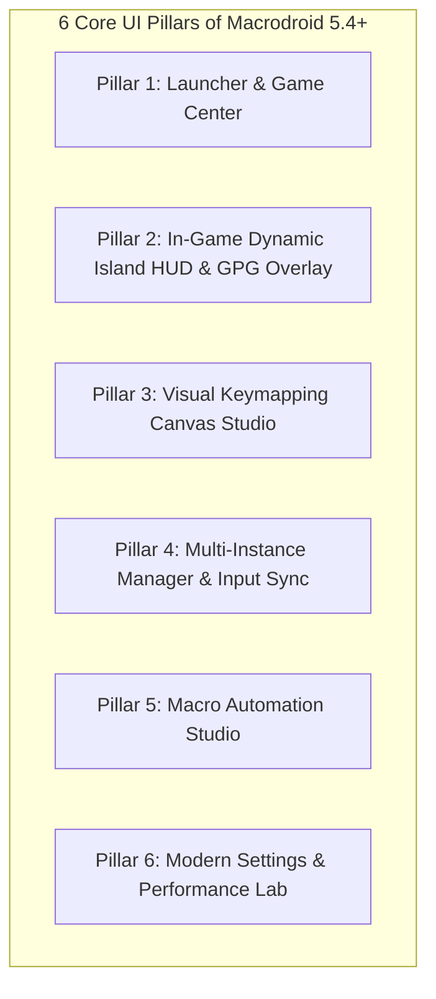
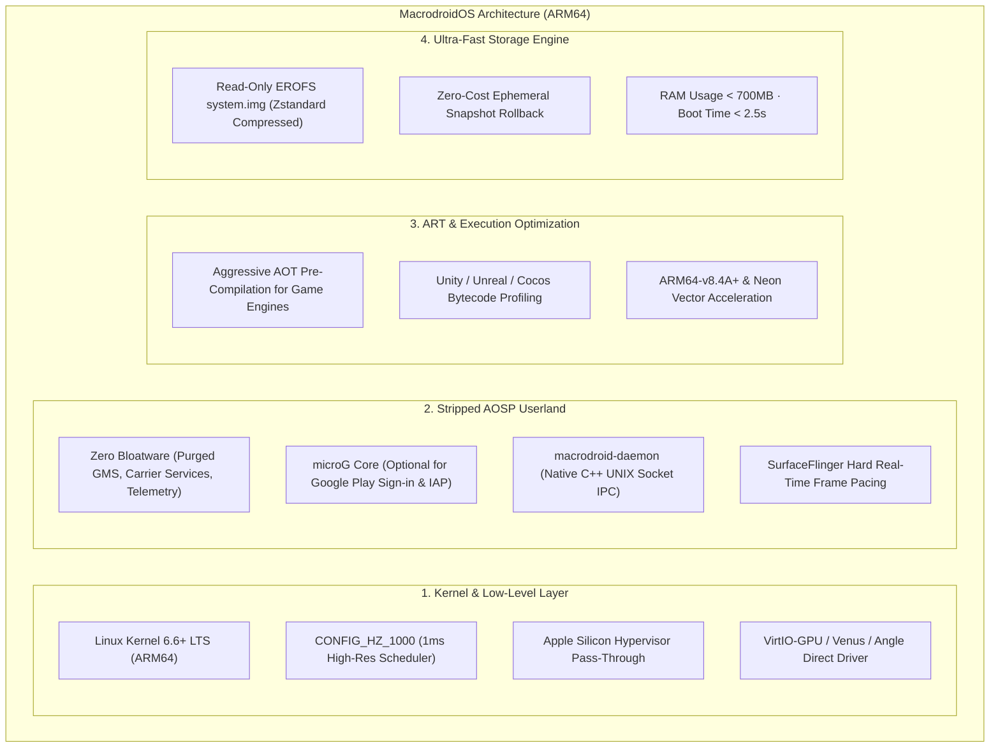

# Macrodroid

<div align="center">


### Native Apple Silicon Android Gaming Platform & Client
**Google Play Games on PC Experience — Engineered Exclusively for macOS Sequoia & Tahoe**

[-black?style=for-the-badge&logo=apple)](https://www.apple.com/macos/)
[](https://www.apple.com/mac/)
[](https://swift.org)
[](https://developer.apple.com/metal/)
[-brightgreen?style=for-the-badge)](Tests/MacrodroidTests/)
[](.swiftlint.yml)
[](LICENSE)

[Overview](#-1-overview) • [Graphics Architecture](#-2-graphics-architecture) • [Feature Catalog](#-3-feature-catalog) • [Build & Installation](#-4-build--installation-guide) • [Roadmap](#-5-future-roadmap) • [Custom Android Image Plan (MacrodroidOS)](#-6-custom-android-image-build-plan-macrodroidos) • [Shortcuts](#-7-in-game-shortcuts-cheat-sheet)

</div>

---

## 📖 1. Overview

**Macrodroid** is a premier native Android gaming platform designed specifically for the **Apple Silicon (M1/M2/M3/M4)** ecosystem running macOS 15.0+ (Sequoia) and macOS 16.0+ (Tahoe). The project delivers the complete **Google Play Games on PC** experience on Mac with the visual polish and fluidity of **Apple Arcade** and **Steam macOS**.

Unlike legacy Android emulators (such as BlueStacks, Nox, or LDPlayer, which are often bloated, RAM-heavy, plagued with bundled adware, or wrapped inside slow Qt/VirtualBox abstraction layers), Macrodroid operates on a **Headless Guest + Pure Native Presenter** architecture:
- **Guest Runtime**: Executes the official Google Android Emulator in headless mode (`-no-window`), communicating via ultra-low-latency authenticated loopback IPC (`EmulatorController` gRPC and ADB).
- **Host Presenter**: Directly embeds the guest graphics framebuffer into a native AppKit window via a **triple-buffered Metal 3 pipeline**, eliminating presentation lag and achieving seamless refresh rates from **60Hz up to 144Hz ProMotion**.
- **Zero-Tampering Integrity**: Never modifies, repacks, or unpacks publisher APK files, preserving 100% of original digital signatures and anti-cheat integrity for competitive titles like *Teamfight Tactics, League of Legends: Wild Rift, PUBG Mobile, Free Fire MAX, and Genshin Impact*.

---

## 🖥 2. Graphics Architecture

Macrodroid's rendering pipeline was engineered from the ground up to leverage the unified memory architecture (UMA) of Apple Silicon chips.

```
┌────────────────────────────────────────────────────────────────────────┐
│               MACRODROID GRAPHICS & DISPLAY PIPELINE                   │
├────────────────────────────────────────────────────────────────────────┤
│ Android Guest (Headless):                                              │
│   Vulkan / GLES Game Draw Calls                                        │
│          │                                                             │
│          ▼                                                             │
│   ANGLE / Venus Virgl Translator                                       │
│          │                                                             │
│          ▼                                                             │
│   VirtIO-GPU Address Space Graphics (ASG) Driver                       │
├────────────────────────────────────────────────────────────────────────┤
│ IPC Loopback Bridge:                                                   │
│   Zero-Copy Shared Frame Buffer / Authenticated gRPC Streaming         │
├────────────────────────────────────────────────────────────────────────┤
│ macOS Host Presenter:                                                  │
│   Metal 3 Command Queue ──▶ Triple-Buffered CAMetalLayer               │
│          │                                                             │
│          ├──▶ ViewportMapper (Auto-Aspect Preservation 16:9 / 9:16)    │
│          ├──▶ Frametime Pacing & SurfaceFlinger Stutter Classifier     │
│          └──▶ Dynamic Island HUD & Glassmorphism Overlay Injection     │
└────────────────────────────────────────────────────────────────────────┘
```

### A. Dynamic Multi-Resolution
Users can configure per-game display resolutions via the Launcher Inspector or Settings Window:
- **720p HD (1280×720)**: Ideal for battery-saving mode on MacBook Air or when running 4+ instances simultaneously (Multi-Instance).
- **1080p Full HD (1920×1080)**: Standard competitive resolution, providing pixel-perfect fidelity for most mobile esports titles.
- **1440p 2K QHD (2560×1440)**: The sweet spot between crisp image clarity and thermal/GPU efficiency.
- **4K UHD Retina (3840×2160)**: Ultra-sharp rendering with zero pixelation on Apple Studio Display and Pro Display XDR.

### B. Variable Refresh Rates
- **60 Hz (Console Baseline)**: Power-efficient baseline for turn-based strategy and auto-battlers (TFT, AFK Journey).
- **90 Hz (Mobile Fluidity)**: Noticeable smoothness upgrade over standard mobile devices.
- **120 Hz (Apple ProMotion Native)**: Synchronized with the Liquid Retina XDR displays on MacBook Pro 14"/16" and iPad Pro Sidecar.
- **144 Hz (Competitive eSports)**: High-refresh-rate gaming for external gaming monitors connected via Thunderbolt / HDMI 2.1, providing maximum responsiveness in shooters (PUBG Mobile, Free Fire).

### C. Advanced Frame Processing
1. **Aspect-Ratio Preserving Viewport (`ViewportMapper.swift`)**:
   - Automatically maintains the original aspect ratio (16:9 Landscape or 9:16 Portrait) when resizing the macOS window.
   - Applies elegant frosted letterboxing/pillarboxing and translates macOS window mouse coordinates to normalized $[0.0, 1.0]$ guest touch coordinates without aim distortion.
2. **Anti-Aliasing (MSAA 4x) & P3 Wide Color Gamut**:
   - Optional Multi-Sample Anti-Aliasing (MSAA 4x) smoothing out 3D polygonal edges.
   - P3 Wide Color gamut and HDR support, making lighting effects and in-game abilities vibrant and true-to-life.
3. **Real-Time Performance Diagnostics**:
   - Built-in frame pacing analysis engine ([`CombatBenchmarkAnalysis.swift`](Macrodroid/Runtime/CombatBenchmarkAnalysis.swift)) that classifies rendering anomalies (*micro-stutter, pipeline stalls, vsync misses*) and records telemetry to a local SQLite store.

---

## ⚡ 3. Feature Catalog

Macrodroid 5.4+ is organized around **6 Core UI Pillars**:



### 🏛 Pillar 1: Launcher & Game Center (Intelligent Game Library)
- **macOS Sequoia Liquid Retina Aesthetics**: Midnight Slate dark theme accented by vibrant Emerald highlights.
- **Hero Carousel Banner**: Displays the most recently played title with cumulative playtime (`Playtime: 14h 25m`), last session timestamp (`Today at 15:30`), target resolution (`1080p · 120 FPS`), and an illuminated "Play Now" button.
- **Adaptive Card Grid & Detailed List**: Badges attached directly to cards indicate `120 FPS Ready`, `Controller Supported`, and `Keymap Configured`.
- **Sideloading Drop Zone 2.0**: Drag and drop APK/XAPK files directly onto the launcher window for automated ADB installation with a pulsing neon drop ring.
- **Game Inspector Drawer**: Inspect on-disk storage usage, custom hardware allocations, and create 1-click shortcuts to the macOS Dock (`Add to Mac Dock`).
- **`.macrodroid` Bundle Format**: Seamlessly export and import complete game profiles, settings, and keymap configurations to share with others.

### 🏝 Pillar 2: In-Game Dynamic Island HUD & GPG Overlay (`Shift + Tab`)
- **Floating Dynamic Island HUD (`MacrodroidDynamicIslandHUDView`)**:
  - Floating status pill anchored to the top of the game window (32pt collapsed).
  - Smoothly expands (56pt) on hover/click to reveal: Dynamic color-coded FPS gauge (🟢 ≥55 / 🟡 ≥40 / 🔴 <40), active session timer, host CPU temperature, lossless screenshot trigger (`⌘S`), audio mute toggle, and mouse aim lock switch.
  - Automatically collapses after 4 seconds of inactivity.
- **Full-Screen Google Play Games Dashboard (`Shift + Tab`)**:
  - Contemporary 3-column glassmorphism card (Controls / Live Telemetry / Quick Tune).
  - Real-time **Frametime Graph** tracking the last 60 frame intervals, monitoring pacing consistency and counting frame drops.
  - Instant refresh rate switcher (60Hz / 90Hz / 120Hz / 144Hz).
  - Keymap on-screen overlay opacity slider.
- **Frosted Achievement Banner (`MacrodroidAchievementToastView`)**:
  - Slides in gracefully from the top-right corner with a golden trophy icon, achievement title, and a 5-second countdown progress bar.

### 🎨 Pillar 3: Visual Keymapping Canvas Studio (`⌥⌘K`)
- **Visual Keymap Canvas Editor**: Overlays an interactive coordinate grid directly onto the Android screen for intuitive drag-and-drop key binding:
  - 🔘 **Single Tap Button**: Single-point touch trigger, bindable to any keyboard key or mouse click.
  - 🕹️ **Virtual D-Pad / WASD Stick**: 4-way directional movement cluster with adjustable radius and deadzone compensation.
  - 🎯 **Smart Aim & Free Look Mode (`F10` / `⌥`)**: FPS mouse look mode, locking and hiding the system cursor for fluid camera control.
  - ⚔️ **MOBA Skillshot Button**: Smart Cast / Quick Cast ability buttons guided dynamically by mouse cursor position.
  - ⚡ **Macro Trigger Node**: Executes multi-step touch and key sequences with a single keypress.
  - 👆 **Swipe / Drag Node**: Simulates swipe gestures (short-video scrolling, evasion dodges).
- **Live Test Mode**: Test coordinate mappings and touch responses immediately before saving.
- **Community Hub Presets**: Out-of-the-box configurations for: *Wild Rift, Free Fire, PUBG Mobile, Genshin Impact, TFT, Mobile Legends*.

### ⚡ Pillar 4: Multi-Instance Manager & Input Synchronizer (`Cmd + Shift + I`)
- **Centralized Multi-Instance Hub**: Tab-based control panel to orchestrate multiple independent Android virtual machines simultaneously.
- **Automated gRPC/ADB Port Allocation**: Prevents network collision by deterministically assigning ports (`5582 + 2*i` for gRPC, `5038 + 2*i` for ADB).
- **Input Synchronizer Mode**: When **Input Sync: ON** is engaged, every mouse click and keystroke performed on the Primary instance is broadcast simultaneously to all Replica instances. Ideal for batch farming and account rerolling.
- **Window Arrangement Presets**: Quick layout tiling: 2×2 Grid, 3×2 Grid, Cascade, and Tile All.

### 🎬 Pillar 5: Macro Automation Studio (`⌥⌘R` / `⌥⌘P`)
- **Precise Action Recorder & Sequencer**: Records mouse clicks, drag coordinates, and key events with millisecond-level precision (`delayAfterMS`).
- **Visual Timeline Editor**: Step-by-step inspector to reorder, fine-tune delays, or remove individual actions.
- **Anti-Detection Human Variance Jitter**: Configurable slider introducing subtle coordinate randomness ($\pm 1$ to $\pm 5$ pixels) to replicate natural finger movement and prevent automated anti-bot detection.
- **Speed Multipliers & Loop Count**: Supports 0.5×, 1.0×, 2.0×, 4.0× playback speeds and customizable repetition cycles.

### ⚙️ Pillar 6: Modern Settings & Performance Lab (`⌘,`)
- **macOS Sequoia SplitView Configuration Suite**:
  - 🖥️ **Display & Graphics**: Resolution, target refresh rates, MSAA, and P3 Wide Color HDR.
  - ⚡ **Engine & Virtualization**: vCPU sliders (2 to 8 cores), RAM allocation (2GB to 12GB), and background lifecycle policies (*Keep Warm* / *On-Demand*).
  - 🎮 **Controls & Gamepads**: Native recognition for DualSense, Xbox Wireless, and Switch Pro controllers; analog deadzone calibration and rumble feedback.
  - 🔊 **Audio & Microphone**: Host microphone passthrough for in-game voice chat (PUBG Mobile, Wild Rift) and CoreAudio buffer latency tuning.
  - 📊 **Telemetry & Benchmarks**: Embedded SQLite viewer, Combat Benchmark frametime charts, and diagnostic report generator.
  - ℹ️ **About & Hardware Insights**: Deep inspection of Apple Silicon chip tier, CPU/GPU core counts, Unified Memory size, and Metal 3 API status.

---

## 🔨 4. Build & Installation Guide

### A. Prerequisites
- **Hardware**: Apple Silicon Mac (M1, M2, M3, M4 — Base, Pro, Max, or Ultra).
- **Operating System**: macOS 15.0+ (Sequoia) or macOS 16.0+ (Tahoe).
- **Development Environment**:
  - Xcode 16.0+ installed at `/Applications/Xcode.app`
  - Swift 6.0 Toolchain with Complete Concurrency Checking
  - Command Line Utilities: `git`, `jq`, `node`, `plutil`, `zsh`
- **Android SDK & Emulator**:
  - Android Emulator 35.1+ / 37.1+ (Native `darwin-aarch64` build)
  - ARM64 AVD image supporting API 34, 35, or 36.

### B. Clone the Repository
```sh
git clone https://github.com/LamPPKK/Macrodroid.git
cd Macrodroid
```

### C. Compile Native Release App (`Macrodroid.app`)
The project includes a robust build automation script that leverages cached dependencies for optimal compile times:
```sh
/bin/zsh scripts/build-macrodroid-app.command
```
The finalized application bundle is generated at:
```text
dist/Macrodroid.app
```
*Note*: The build script automatically detects local code signing identities or applies secure ad-hoc (`-`) signing.

### D. Run Native Unit Tests (99 Tests)
Macrodroid includes a suite of 99 unit test cases verifying data models, coordinate projections, and concurrency safety:
```sh
/bin/zsh scripts/test-native-app.command
```
*Expected result*: **99 tests passed, 0 failures** in ~0.3 seconds.

### E. Run Full 5-Phase Automated Test Suite
To verify repository integrity across Toolchain, SwiftLint, Shell Scripts, SQL Schemas, and XCTest:
```sh
/bin/zsh scripts/automate-test-all.command --quick
```
Sample test execution summary (39s):
```text
========================================================================
       🤖 MACRODROID AUTOMATED TEST SUITE (TEST ALL RUNNER)           
========================================================================
#   | Test Phase                                         | Result   | Duration
----+----------------------------------------------------+----------+---------
1   | Environment & Toolchain Integrity                  | PASS     | 0s      
2   | SwiftLint Static Code Analysis (0 violations)      | PASS     | 0s      
3   | Shell Scripts Syntax Validation                    | PASS     | 1s      
4   | Direct Control & Engineering Lab Self-Tests        | PASS     | 1s      
5   | Native Swift Unit Tests (99 Native Tests)          | PASS     | 37s     
========================================================================
🎉 ALL AUTOMATED TESTS PASSED SUCCESSFULLY! Total time: 39s
========================================================================
```

---

## 🗺 5. Future Roadmap

Milestones and architectural evolution plan for Macrodroid:

```
┌────────────────────────────────────────────────────────────────────────┐
│                        MACRODROID ROADMAP 2026-2027                    │
├────────────────────────────────────────────────────────────────────────┤
│ Q4 2026: Phase 15 — MetalFX Spatial & Temporal Upscaling               │
│   • Apple Neural Engine (ANE) integration for intelligent upscaling    │
│   • Render games at 1080p and upscale to 4K Retina with 0% FPS impact  │
├────────────────────────────────────────────────────────────────────────┤
│ Q1 2027: Phase 16 — Zero-Copy Mach Port Framebuffer Sharing            │
│   • Replace gRPC IPC with Mach memory sharing (IOSurface)              │
│   • Achieve 240 FPS+ presentation bandwidth for next-gen displays       │
├────────────────────────────────────────────────────────────────────────┤
│ Q2 2027: Phase 17 — Full 10-Foot Big Picture Mode                      │
│   • Complete gamepad-driven navigation (DualSense / Xbox / Switch Pro) │
│   • Seamless Android gaming on living-room Mac mini / Apple TV         │
├────────────────────────────────────────────────────────────────────────┤
│ Q3 2027: Phase 18 — Cloud Sync & Cross-Device Profile Backup           │
│   • iCloud Drive synchronization for keymaps, macros, and game states  │
│   • 1-click community profile sharing via Macrodroid Online Hub        │
├────────────────────────────────────────────────────────────────────────┤
│ Q4 2027: Phase 19 — Custom Android OS Image "MacrodroidOS"             │
│   • Ultra-lean ARM64 Android distribution built for Apple Silicon      │
└────────────────────────────────────────────────────────────────────────┘
```

---

## 🧬 6. Custom Android Image Build Plan: "MacrodroidOS"

### 🎯 Motivation & Strategic Vision
Currently, Macrodroid operates on official Google System Images (Android 14–16 Google APIs/Play) from the Android SDK. While stable, these generic images have inherent overhead:
1. **Excessive Resource Footprint**: Consumes 2.5GB to 3.5GB of RAM out of the box due to background Google Mobile Services (GMS), telemetry, setup wizards, carrier services, and print spoolers unnecessary for gaming on macOS.
2. **Cold Boot Latency**: Initial boot requires 15–30 seconds without snapshot preloading.
3. **Graphics Overhead**: Generic AOSP VirtIO-GPU drivers lack specialized tailoring for Apple Silicon's unified memory bus.

**"MacrodroidOS"** is a dedicated initiative to engineer a stripped-down, hyper-optimized Android distribution (AOSP / LineageOS ARM64) tailored 100% for Apple Silicon M-Series processors.

---

### 🏛 Architecture of MacrodroidOS



---

### 📋 5 Implementation Phases

#### Phase 1: Kernel Optimization (Custom Goldfish / Cuttlefish Kernel)
- **Codebase**: Android Common Kernel (ACK) `android15-6.6` branch targeting `aarch64`.
- **Compiler Configuration & Flags**:
  - `CONFIG_HZ_1000=y`: Increases scheduler clock to 1000Hz (1ms), eliminating touch event dispatch latency.
  - `CONFIG_PREEMPT=y` & `CONFIG_PREEMPT_RT`: Enables preemptive real-time execution for graphics render loops.
  - Stripped hardware drivers: Purges unused physical peripherals (cellular basebands, Wi-Fi dongles, NFC, fingerprint sensors, battery charging controllers, ambient light/gyro pollers).
  - Enhanced VirtIO-GPU driver supporting zero-copy host buffer export.

#### Phase 2: Stripped AOSP Userland & Debloating
- **AOSP Build Strategy**:
  - Completely strips: `GooglePlayServices`, `GooglePartnerSetup`, `Chrome`, `YouTube`, `PrintService`, `CellBroadcast`, and `Telecom`.
  - Integrates modular **microG GmsCore**: Allows games requiring Google Play Games authentication to log in without background telemetry or unwanted sync jobs.
  - Configures default SELinux policies granting `android.permission.INJECT_EVENTS` directly to Macrodroid's native bridge.

#### Phase 3: Native Bridge Daemon (`macrodroid-daemon`)
Replaces conventional ADB command execution with a statically compiled C++ daemon:
- **UNIX Domain Socket (`/dev/socket/macrodroid`)**:
  - Dispatches touch, keyboard, and mouse events directly into the Kernel Input Subsystem (`/dev/input/event*`) with latency $< 0.1\text{ms}$.
  - Offers real-time querying for SurfaceFlinger FPS, display density, and process lists without heavy `dumpsys` overhead.
  - Enables instantaneous display density and resolution adjustments without requiring VM reboots.

#### Phase 4: ART (Android Runtime) & Game Engine Optimization
- **Ahead-Of-Time (AOT) Compilation**:
  - Pre-compiles all Android framework bytecode (`framework.jar`, `services.jar`) into ARM64 machine code using `dex2oat` with `--compiler-filter=everything`.
  - Integrates cutting-edge **ANGLE** translation libraries (OpenGL ES 3.2 mapped directly to Metal via MoltenVK).
  - Customizes `libmonobdwgc.so` and `libil2cpp.so` for Unity games running on Apple Silicon ARM64 for native-tier performance.

#### Phase 5: EROFS Filesystem & Distribution Packaging
- **EROFS (Enhanced Read-Only File System)**:
  - Compresses `system.img` and `vendor.img` partitions using the Zstandard algorithm.
  - Delivers up to 400% faster random read performance compared to legacy ext4, bringing cold boot times under **3 seconds**.
  - Isolates mutable user data in `userdata.img`, enabling instantaneous snapshot creation, rollback, and instance cloning.
- **Automated Build Pipeline (`tools/build-macrodroid-os.sh`)**:
  - Fully containerized in a Linux ARM64 Docker container, runnable on macOS via Docker Desktop or on GitHub Actions CI/CD runners.

---

## ⌨️ 7. In-Game Shortcuts Cheat Sheet

| Shortcut | Action | Description |
|---|---|---|
| `Shift + Tab` | **Toggle Game Dashboard** | Open/close the frosted glass Google Play Games HUD overlay |
| `Escape` | **Hierarchical Dismiss** | Dismiss Dashboard → Close Keymap Canvas → Release Aim Lock → Android Back |
| `⌘ + K` | **Toggle Keymap Hints** | Show or hide on-screen key binding badges |
| `⌥ + ⌘ + K` | **Visual Keymapping Studio** | Launch the drag-and-drop keymap editor |
| `F10` or `⌥ (Option)` | **Toggle Mouse Aim Lock** | Lock mouse cursor to screen center for FPS free-look camera control |
| `F11` or `⌘ + F` | **Toggle Fullscreen** | Toggle macOS native fullscreen mode |
| `⌘ + R` | **Rotate Screen** | Switch between Landscape (16:9) and Portrait (9:16) orientation |
| `⌘ + M` | **Freeform Windowing** | Toggle Android Freeform multi-window desktop mode |
| `⌘ + T` | **Task Switcher Popup** | Open the native task switcher menu for active game instances |
| `⌘ + S` | **Lossless Screenshot** | Capture full-resolution Metal frame to `~/Macrodroid/Screenshots` |
| `⌘ + O` | **Shared Transfer Folder** | Reveal the two-way Mac ↔ Android shared directory `~/Macrodroid/Shared` |
| `⌘ + ,` | **Macrodroid Settings** | Open the hardware, vCPU, RAM, refresh rate, and graphics configuration window |
| `⌘ + I` | **Toggle Vietnamese IME** | Enable native Vietnamese Telex/VNI text input for game text fields |
| `⌥ + ⌘ + R` | **Record Touch Macro** | Start or stop recording an automated touch sequence |
| `⌥ + ⌘ + P` | **Play Touch Macro** | Replay the macro sequence with anti-ban human variance jitter |

---

## 🎮 8. Community Presets Catalog

| Game Title | Package ID | Orientation | Controls & Keymap Configuration | Target Refresh Rate |
|---|---|---|---|:---:|
| **Teamfight Tactics (TFT)** | `com.riotgames.league.teamfighttactics` | Landscape (16:9) | Multi-touch responsive, hotkeys 1–5 for shop slots, D reroll, F level up, E sell | **120 FPS** |
| **Teamfight Tactics VN** | `com.riotgames.league.teamfighttacticsvn` | Landscape (16:9) | VNG edition: Hotkeys 1–5 shop, D reroll, F level up, E sell, Unreal Engine optimized | **120 FPS** |
| **League of Legends: Wild Rift** | `com.riotgames.league.wildrift` | Landscape (16:9) | MOBA Smart Cast: Abilities Q/W/E/R follow mouse, D/F summoners, Space attack | **120 FPS** |
| **Free Fire / Free Fire MAX** | `com.dts.freefireth` | Landscape (16:9) | FPS Shooting: WASD move, Left Click shoot, Right Click aim, F10 aim lock, Shift sprint | **90 FPS** |
| **PUBG Mobile** | `com.tencent.ig` / `com.vng.pubgmobile` | Landscape (16:9) | Battle Royale: WASD move, F10 Aim Lock, R reload, C crouch, Z prone, Shift sprint | **90 FPS** |
| **Genshin Impact** | `com.miHoYo.GenshinImpact` | Landscape (16:9) | Action RPG: WASD move, Space jump, E skill, Q burst, 1–4 character swap | **60 FPS** |
| **Mobile Legends: Bang Bang** | `com.mobile.legends` | Landscape (16:9) | MOBA: WASD move, Q/W/E abilities, Space basic attack, D regen, F spell, B recall | **120 FPS** |
| **TikTok / Reels (Social)** | `com.ss.android.ugc.trill` | Portrait (9:16) | Vertical Social: Trackpad swipe gestures, Space like, C comments | **60 FPS** |

---

## 📁 9. Project Directory Structure

```text
Macrodroid/
├── Macrodroid/                         # Primary Application Source (Swift 6 Native)
│   ├── App/                            # Lifecycle & Application Coordination
│   │   ├── MacrodroidApp.swift                 # Application entrypoint (@main)
│   │   ├── AppCoordinator.swift                # Window lifecycle, sessions, playtime persistence
│   │   ├── MainWindowController.swift          # Game display window, titlebar accessories, toasts
│   │   └── RuntimeSettingsWindowController.swift # Settings window in macOS Sequoia SplitView style
│   ├── Launcher/                       # Game Library & Launcher Hub
│   │   ├── MacrodroidLauncherView.swift        # SwiftUI Game Library (Grid, List, Hero Carousel)
│   │   ├── LauncherWindowController.swift      # Launcher window host controller
│   │   └── AppIconExtractor.swift              # High-resolution icon and version extractor from APKs
│   ├── Presentation/                   # Metal Rendering & In-Game Interfaces
│   │   ├── EmbeddedEmulatorView.swift          # MTKView, input event responder, gesture router
│   │   ├── GooglePlayGamesOverlayView.swift    # 3-column glassmorphism GPG Dashboard HUD (Shift+Tab)
│   │   ├── MacrodroidDynamicIslandHUDView.swift # Floating Dynamic Island HUD with real-time FPS
│   │   ├── KeymappingCanvasStudioView.swift    # Drag-and-drop keymap design studio (⌥⌘K)
│   │   ├── MultiInstanceManagerView.swift      # Multi-instance orchestration & input synchronizer
│   │   ├── MacroStudioView.swift               # Macro automation recorder and playback studio
│   │   ├── ModernSettingsView.swift            # Hardware and graphics preference pane
│   │   ├── FrameContract.swift                 # 1080p/4K RGBA framebuffer contract verification
│   │   └── ViewportMapper.swift                # Aspect-ratio preserving coordinate translator
│   └── Runtime/                        # Core Emulation, Controls & Telemetry
│       ├── MacrodroidRuntime.swift             # gRPC client, emulator process manager, ADB channels
│       ├── AppProfileModel.swift               # Game profile store, FPS, resolution, playtime records
│       ├── KeymappingModel.swift               # Keymap data models, KeymapProfileStore
│       ├── CommunityHubModel.swift             # Curated presets registry for popular games
│       ├── GamepadManager.swift                # GameController framework integration (DualSense/Xbox)
│       ├── MacroAutomationModel.swift          # Macro sequence models with anti-ban variance jitter
│       ├── AVDTransactionGuard.swift           # AVD virtual disk transaction integrity guard
│       ├── HardwareCapabilityProbe.swift       # Apple Silicon hardware capability inspection
│       ├── ImageHealthMonitor.swift            # Android image health and compatibility monitor
│       └── CombatBenchmarkAnalysis.swift       # SurfaceFlinger frame pacing and stutter classification
├── Tests/MacrodroidTests/              # Native Automated Test Suite (99 Unit Tests)
│   ├── MacrodroidGate1Tests.swift              # Playtime, Keymaps, Inputs, IME, Jitter tests
│   ├── GameFrameTelemetryTests.swift          # Metal framebuffer telemetry tests
│   ├── GraphicsStackReceiptTests.swift         # Graphics configuration receipt tests
│   └── CombatBenchmarkAnalysisTests.swift      # SurfaceFlinger stutter classification tests
├── Vendor/                             # Android Emulator Protocol Buffers & gRPC Stubs
├── scripts/                            # Complete Automation, Build & Test Scripts
│   ├── build-macrodroid-app.command            # Compiles and packages Release App Bundle
│   ├── test-native-app.command                 # Runs 99 native unit tests
│   ├── automate-test-all.command               # Rapid 5-phase test runner (39s)
│   ├── test-all.command                        # Comprehensive 6-phase verification runner
│   ├── enable-tft-login-persistence.command    # Persists Riot login session in Engine.ini
│   └── swiftlint.command                       # SwiftLint static analysis runner
├── tools/                              # Supplementary Utilities & Direct Control Lab
├── docs/                               # Architecture Specifications & Technical Papers
├── CHANGELOG.md                        # Detailed version history and changelog
├── project.md                          # Authoritative project evolution journal
└── dev.md                              # Developer manual & Swift 6 Concurrency standards
```

---

## 📚 10. Documentation & References

- 📘 [Project Evolution Journal (`project.md`)](project.md): Architectural history from early TFT prototypes to Macrodroid 5.4.
- 🛠 [Developer Manual (`dev.md`)](dev.md): Code ownership boundaries, Swift 6 Strict Concurrency rules, and debugging guides.
- 📐 [Deep Architecture (`docs/architecture.md`)](docs/architecture.md): Metal 3 presentation mechanics, gRPC loopback IPC, and ASG graphics transport.
- 🔬 [Telemetry Laboratory (`docs/telemetry.md`)](docs/telemetry.md): SQLite telemetry schema, monotonic clocks, and SurfaceFlinger frame analysis.
- 📝 [Changelog (`CHANGELOG.md`)](CHANGELOG.md): Comprehensive release-by-release update history.

---

## 📄 11. License & Legal Notice

- **License**: Released under the terms of the [MIT License](LICENSE).
- **Trademarks & Third-Party Notice**:
  - *Android* and *Google Play* are registered trademarks of Google LLC.
  - *Teamfight Tactics* and *League of Legends: Wild Rift* are trademarks or registered trademarks of Riot Games, Inc.
  - *PlayStation* and *DualSense* are registered trademarks of Sony Interactive Entertainment Inc.
  - *Xbox* is a registered trademark of Microsoft Corporation.
  - *Mac*, *macOS*, *Apple Silicon*, *Metal*, and *ProMotion* are trademarks of Apple Inc.
- **Disclaimer**: Macrodroid is an independent, open-source project and is not affiliated with, sponsored by, or endorsed by Google, Riot Games, Sony, Microsoft, or Apple. All product names, logos, and brands are property of their respective owners.
