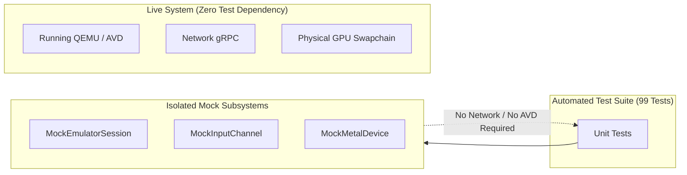

# Reproducibility & Environment Isolation

This document outlines the architectural boundaries and reproducibility guarantees in **Macrodroid 5.4**, separating version-controlled repository assets from mutable host runtime environments.

---

## 1. Version-Controlled Authority

The Git repository holds the canonical, reproducible source authority:

- **Source Code**: Swift 6 source files with strict concurrency annotations.
- **Project Structure**: Pinned `Macrodroid.xcodeproj` and `Package.resolved` dependencies.
- **Protocol Contract**: Pinned Android emulator gRPC definitions:
  - `Vendor/AndroidEmulator/emulator_controller.proto`
  - Integrity hash validated by `Vendor/AndroidEmulator/SOURCE.json`.
- **Automated Verification**: 99 unit and integration tests capable of running in headless CI without an external Android emulator running.

---

## 2. Mutable Host Runtime State (Excluded from Git)

To maintain clean repository hygiene, zero data pollution, and strict user privacy, the following elements are excluded via `.gitignore`:

- **Android Virtual Device (AVD) Images**: Guest userdata, cache partitions, and system snapshots.
- **Google & Game Credentials**: Account tokens, auth cookies, Riot IDs, and Keychain entries.
- **Third-Party APKs**: Game application packages and installation archives.
- **Telemetry Databases**: Local SQLite sessions (`~/Library/Application Support/Macrodroid/Captures/`).
- **Compiler Build Trees**: DerivedData and intermediate object files.

---

## 3. Test Determinism & Mock Architecture

Unit and integration tests achieve 100% deterministic reproducibility through mock isolation:



Tests execute reliably across clean developer workstations and CI runners without requiring QEMU hypervisor privileges.

---

## 4. Verification & Validation Gate

To verify environment reproducibility locally:
```sh
DEVELOPER_DIR=/Applications/Xcode.app/Contents/Developer xcodebuild test \
  -project Macrodroid.xcodeproj \
  -scheme Macrodroid \
  -configuration Debug \
  -destination 'platform=macOS' \
  ONLY_ACTIVE_ARCH=YES \
  CODE_SIGNING_ALLOWED=NO
```
